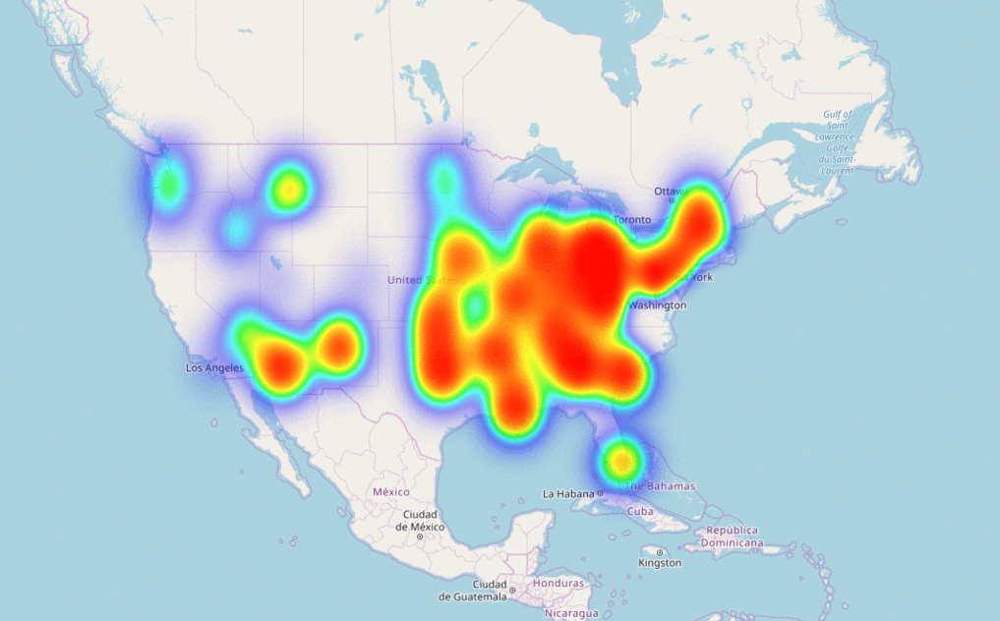

# Cloud-Cover-Weather-model
Use this weather model if you care about *Cloud Cover percentage* as well as *Cloud Heights*. Created by extracting METAR data from weather stations. Currently made for the U.S. but can be adjusted for any place in the world with METAR stations.

Data is extracted from the [Iowa Environmental Mesonet (IEM)](https://mesonet.agron.iastate.edu/request/download.phtml), which is a network of computers responsible for collecting, disseminating and archiving weather observation data. The observations are in the form of METAR data containing hourly observations of cloud cover percentage and height.

Visualisation of Cloud Cover across the U.S. on different days:

## Getting Started

### Prerequisites

The program requires [Python >= 3.7](https://www.python.org/downloads/) to be downloaded and installed on the machine.
Last tested on Python 3.7.

## Notebooks
There are two notebooks in this repo. 'Weather Model US' is for downloading the data from the IEM and cleaning it using various pre-processing steps. 'Spatial Interpolation of Weather Data' is for creating an interpolation model through which we can predict the average cloud cover (Okta) value at any location and day in the U.S.

#### 1. Weather Model US
- Input: Iowa Environmental Mesonet (IEM) dataset of Cloud data
- Process: Shows the process of pulling 7 years of METAR data from the IEM and then processing it to
give a quantifiable measure of Okta (cloud cover) values throughout the U.S.
- Output: Dataframe containing average Okta value for each day of the year at 50 weather stations across the U.S. This
dataframe is called `US_weather_7yr_avg`
- Only edit this notebook if you want to pull more data (e.g. more weather stations across the U.S.)

#### 2. Spatial Interpolation of Weather Data
- Input: `US_weather_7yr_avg` dataframe
- Process: An okta prediction model is trained using data points at 50 weather stations. This model is used to interpolate okta values across the U.S. interpolate them across the U.S. Now we can obtain average Okta values at any lat, lon position in the U.S.
- Output: Regression model trained over 7 years of weather data `gprs_7yr_pickled`
- Only edit this notebook if the prediction model needs to be trained again over new data, or change required in the model itself.
- Contains bonus content of how to create a nice visualisation using a heatmap
